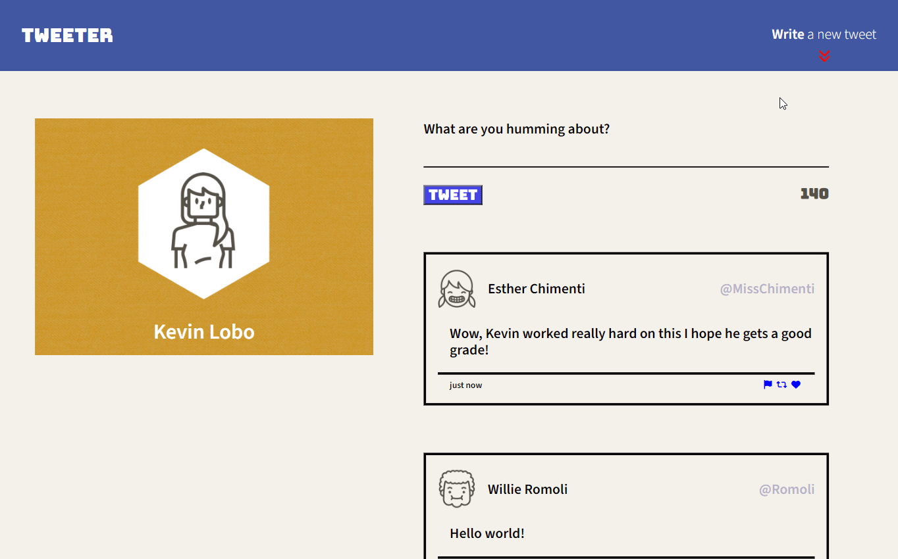
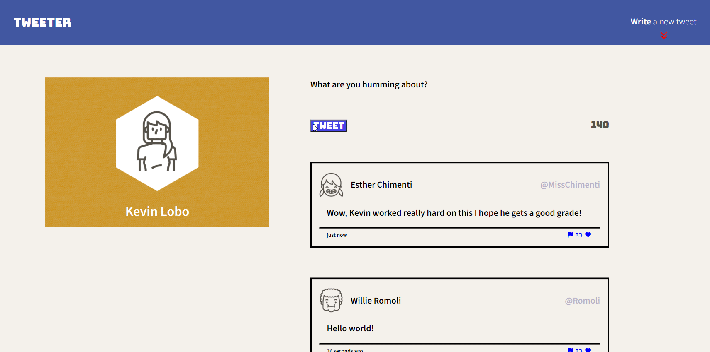

# Tweeter Project

Tweeter is a simple, single-page Twitter clone.

This repository is the starter code for the project: Students will fork and clone this repository, then build upon it to practice their HTML, CSS, JS, jQuery and AJAX front-end skills, and their Node, Express back-end skills.

## Getting Started

1. [Create](https://docs.github.com/en/repositories/creating-and-managing-repositories/creating-a-repository-from-a-template) a new repository using this repository as a template.
2. Clone your repository onto your local device.
3. Install dependencies using the `npm install` command.
3. Start the web server using the `npm run local` command. The app will be served at <http://localhost:8080/>.
4. Go to <http://localhost:8080/> in your browser.

## On Tweeter

🌐 Once you navigate to [http://localhost:8080/](http://localhost:8080/), the website will load with two example tweets. Get started writing your own tweets by clicking **'Write a new tweet'** in the top-right navigation bar.

📝 This action will pull down and focus the tweet submission form. Feel free to write your own message, but keep it **140 characters or under!** Notice the stylish counter with its three different colour states, base, low, and negative! Indicating how much text you have left – **wowza!** Click **'Write a new tweet'** again to pull the submission form back up, just like magic.

**Post some valid tweets and scroll down the webpage.** 📜 The **'Write a new tweet'** button will disappear, and a very cool arrow button will appear at the bottom-right of the screen! Clicking it will bring you back up to the top of the page, **redrop the tweet submission form** (if it's down), and focus it again – **wowza!**

## Error Handling

**Try posting some invalid tweets!** 🚫 For example, something empty or one that has over 140 characters. Notice the jaw-dropping error animation that plays. **Doesn't a flashing error message really scream 'You messed up!'?** What's the point of an error that isn't a little sassy?

## One Size Doesn't Fit All

📱 Try different sizes for the website! **Smoosh** the website down under **1024 pixels in width** to get a more mobile-friendly/smaller screen experience. Now you can try all the features again in this new **cool mode** – **wow!**

🖥️ Do you have more money than me and own an ultra-wide monitor? **No problem!** The tweets and profile picture will stop expanding at a certain point, giving you a **more user-friendly experience**. He really thought of everything! 🧠

## Dependencies

- Express
- Node 5.10.x or above
